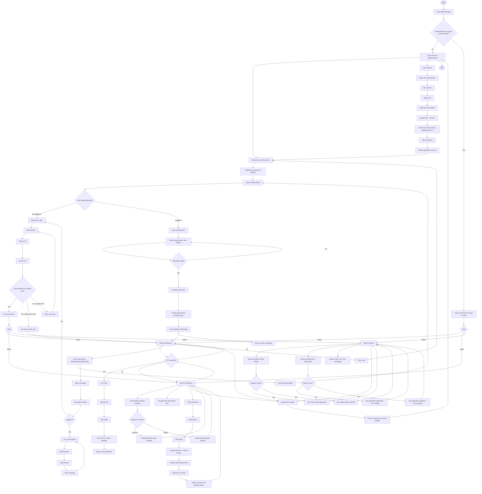

# MotoRent Full Activity Diagram

```mermaid
flowchart TD
    A([Start]) --> B[Open MotoRent App]
    B --> C{Authenticated user exists in local storage?}

    C -- No --> G[Guest lands on Explore/Home]
    C -- Yes --> D[Load currentUser into App Context]
    D --> E{Role}
    E -- renter --> RDash[Renter Dashboard]
    E -- owner --> ODash[Owner Dashboard]
    E -- admin --> ADash[Admin Console]

    %% Guest / Public flow
    G --> G1[Browse map or browse list]
    G1 --> G2[Filter/Search approved vehicles]
    G2 --> G3[Open vehicle details]
    G3 --> G4{Click Request Booking}
    G4 -- Not logged in --> L0[Redirect to Login]
    G4 -- Logged in --> BForm[Open booking form]

    %% Auth flow
    L0 --> L1[Enter phone]
    L1 --> L2[Send OTP]
    L2 --> L3[Enter OTP]
    L3 --> L4{Phone belongs to existing user?}
    L4 -- Yes --> L5[Set currentUser]
    L4 -- No + demo OTP valid --> L6[Use demo renter user]
    L4 -- No + invalid OTP --> L7[Show auth error]
    L7 --> L1
    L5 --> L8{Role}
    L6 --> RDash
    L8 -- renter --> RDash
    L8 -- owner --> ODash
    L8 -- admin --> ADash

    %% Signup flow
    G --> S0[Open Signup]
    S0 --> S1[Select role renter/owner]
    S1 --> S2[Enter phone]
    S2 --> S3[Verify OTP]
    S3 --> S4[Enter personal details]
    S4 --> S5[Upload NID + License]
    S5 --> S6[Create user with pending registration/KYC]
    S6 --> S7[Set currentUser]
    S7 --> S8[Show registration success]
    S8 --> G1

    %% KYC flow
    RDash --> K0{KYC required?}
    ODash --> K0
    K0 -- Yes --> K1[KYC intro]
    K1 --> K2[Upload NID]
    K2 --> K3[Take selfie]
    K3 --> K4[Set user KYC status pending]
    K4 --> K5[Back to role dashboard]
    K0 -- No --> RDash
    K0 -- No --> ODash

    %% Booking flow
    BForm --> BF1[Enter start/end date, time, pickup]
    BF1 --> BF2{Valid date range?}
    BF2 -- No --> BF1
    BF2 -- Yes --> BF3[Calculate total price]
    BF3 --> BF4[Create booking with pending status]
    BF4 --> BF5[Go to booking confirmation]
    BF5 --> BF6[User can open messages]
    BF5 --> RDash

    %% Renter dashboard
    RDash --> R1[View booking tabs: all/active/history/spending]
    R1 --> R2[Open booking details]
    R2 --> G3
    R1 --> R3[Open messages]
    R3 --> M0[Messages module]
    RDash --> R4[Find a ride]
    R4 --> G1

    %% Owner dashboard
    ODash --> O1[See pending booking requests]
    O1 --> O2{Approve or reject?}
    O2 -- Approve --> O3[Update booking status accepted]
    O2 -- Reject --> O4[Update booking status rejected]
    O3 --> ODash
    O4 --> ODash
    ODash --> O5[Manage fleet and finance tabs]
    ODash --> O6[Add vehicle flow]
    O6 --> OV1[Enter basics]
    OV1 --> OV2[Set pricing]
    OV2 --> OV3[Choose features + upload photos]
    OV3 --> OV4[Upload vehicle documents]
    OV4 --> OV5[Submit new vehicle]
    OV5 --> OV6[Vehicle created with pending status]
    OV6 --> ODash

    %% Admin dashboard
    ADash --> A1[Review pending vehicle listings]
    A1 --> A2{Approve listing?}
    A2 -- Yes --> A3[Set vehicle status approved]
    A2 -- No --> A4[Set vehicle status rejected]
    A3 --> ADash
    A4 --> ADash

    ADash --> A5[Review pending user registrations]
    A5 --> A6{Approve user?}
    A6 -- Yes --> A7[Set registration approved + KYC verified]
    A6 -- No --> A8[Set registration rejected + KYC rejected]
    A7 --> ADash
    A8 --> ADash

    ADash --> A9[Monitor users, live map, and ledger]

    %% Messaging flow
    M0 --> M1{Logged in?}
    M1 -- No --> L0
    M1 -- Yes --> M2[List conversations]
    M2 --> M3[Select partner]
    M3 --> M4[Read thread]
    M4 --> M5[Send message]
    M5 --> M2

    %% Logout
    RDash --> LO[Logout from header]
    ODash --> LO
    ADash --> LO
    LO --> LOUT[Clear currentUser and local storage]
    LOUT --> G
    G --> Z([End])
```

